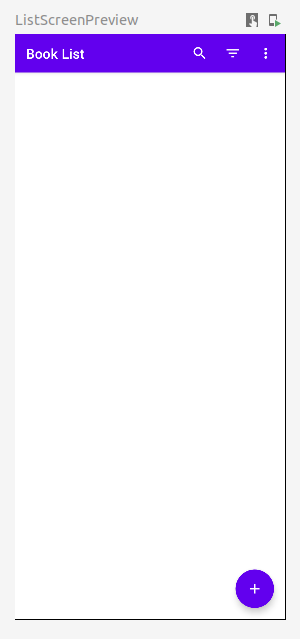
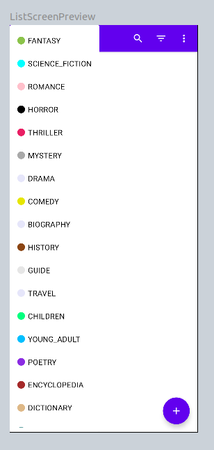
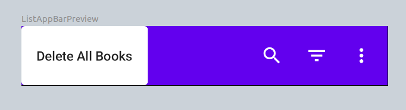

= microproject - BOOKS

2022/23 - 5AHIF Neudorfer Niklas _alias_ #Avatar#

== Current State

-> Udemy Course - finished `22. List Screen - List App Bar Actions`

.Full View of the current Application

.DropDown when pressing the sort button (the middle one)

.Menu that pops-up when pressing the vertical-menu Button (the Button on the right side)

== Important Notes

lines of code in order to make `by remember { mutableStateOf(false) }` work

[source,kotlin]
====
import androidx.compose.runtime.getValue
import androidx.compose.runtime.setValue
====

== Explanation of Folder Layout

[source]
-----
.
├── books
│   ├── Frontend
│   └── with Jetpack-Compose
├── library
│   ├── Backend
│   └── with Quarkus, for getting data
├── docs
│   ├── AsciiDoc
│   ├── documentation
│   └── location for screenshots & images
└── README.adoc
-----

== Source

* https://www.udemy.com/course/to-do-app-with-jetpack-compose-mvvm-android-development/learn/lecture/27993710#overview[Udemy Course]