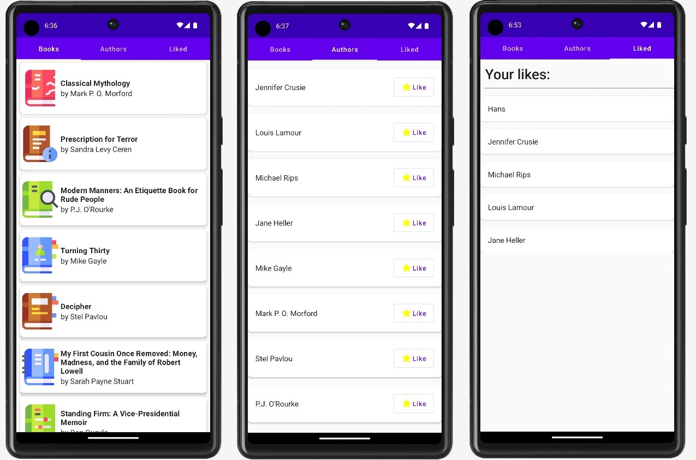

# microproject - BOOKS

2022/23 - 5AHIF Neudorfer Niklas _alias_ Avatar

# Source:

* [Kaggle - CSV Data](https://www.kaggle.com/datasets/saurabhbagchi/books-dataset)
* [Placeholder Credits!!](https://www.flaticon.com/free-icons/bookmark)
  * Needed this "placeholders" because the links from the CSV File are AWS-Links and those
    won't work without a AWS-Account. So I used this placeholder images instead. :^)

## Important Links

* [Documentation](https://github.com/2223-5ahif-nvs/03-lab-android-simple-room-db-microproject-NiklasNeudorfer/blob/main/docs/index.adoc)

## Current State

Added *RoomDB* including Dagger-Hilt

* <strong>Navigation:</strong>
  * Added simple Navigation with the "Tabs"-Component
  * This is an alternative to a more complex Navigation implementation,
    but it also works for simple usage

* <strong>RooomDB:</strong>
  * Added a Database to the Android App - it is used to store the "data of the user";
  * The user can *like* an author and the app will show the liked authors in the *Liked Authors* section

* <strong>Dagger-Hilt:</strong>
  * "Dagger-Hilt" is a Dependency used for _Dependency Injection_
  * I used Dagger-Hilt to inject the `Database` into the `ViewModel`

