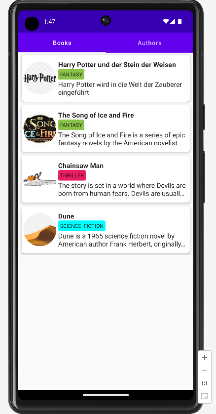
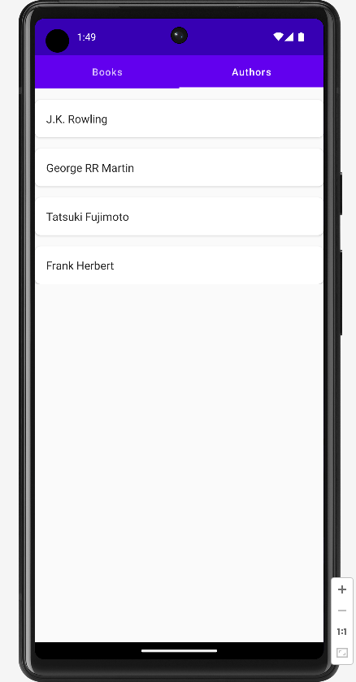

# microproject - BOOKS

2022/23 - 5AHIF Neudorfer Niklas _alias_ Avatar

# Source:

* [Kaggle - CSV Data](https://www.kaggle.com/datasets/saurabhbagchi/books-dataset)
* [Placeholder Credits!!](https://www.flaticon.com/free-icons/bookmark)

## Important Links

* [Documentation](https://github.com/2223-5ahif-nvs/03-lab-android-simple-room-db-microproject-NiklasNeudorfer/blob/main/docs/index.adoc)

## Current State

* I've added Tabs, so I can display 2 different Screens, and navigate between them very easily

* I can get data from my local Endpoint and display it on the Emulator

    * I created a new Project, so I can start from scratch and not have to deal with the old code where I encountered an
      error which I don't know how to fix at the moment.

