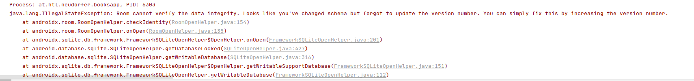

= Simple RoomDB Example
Neudorfer Niklas
1.0.0, 2022-12-15
ifndef::imagesdir[:imagesdir: .]
//:toc-placement!:
:sourcedir: ../src/main/java
:icons: font
:sectnums:
:toc: left

//Need this blank line after ifdef, don't know why...
ifdef::backend-html5[]

// print the toc here (not at the default position)
//toc::[]

== Files we will be working with:

[source]
-----
at.htl.neudorfer.booksapp
├── data
│   ├── Author <.>
│   └──  ...
├── model
│   ├── api
│   ├── db
│   │   ├── dao
│   │   │   ├── AuthorDao <.>
│   │   │   └── ...
│   │   ├── AppDatabase <.>
│   │   └── AppModule <.>
│   ├── AuthorRepository <.>
│   └── ...
├── ui
│   └── ...
├── BaseApplication <.>
└── MainActivity <.>
-----

<.> *Entity* classes
<.> *DAOs*
<.> *Database* class
<.> Dagger-Hilt *Module* class
<.> Repositories
<.> Dagger-Hilt *BaseApplication*
<.> *MainActivity*

== Dependencies & Versions

=== RoomDB dependencies

We need to add the following dependencies to our *build.gradle*(:app) file:

[source,groovy]
-----
    //-------------------------------------------------------
    //      ROOM -- Database
    //-------------------------------------------------------
    def room_version = "2.4.3"

    implementation "androidx.room:room-runtime:2.4.3"
    kapt "androidx.room:room-compiler:2.4.3"
    implementation "androidx.room:room-ktx:2.4.3"

    // Datastore preferences
    implementation "androidx.datastore:datastore-preferences:1.0.0"
-----

=== Dagger-Hilt dependencies

[source,groovy]
-----
    //-------------------------------------------------------
    //      Dagger Hilt -- Dependency Injection
    //-------------------------------------------------------

    implementation "com.google.dagger:hilt-android:2.40.5"
    kapt "com.google.dagger:hilt-android-compiler:2.40.5"
    implementation "androidx.hilt:hilt-navigation-compose:1.0.0"
-----

=== Versions

* In my example I am using the following versions:

** *Kotlin*: 1.7.20
** *Kotlin-Compiler*: 1.3.2
** *Compose UI* Version: 1.3.2
** compile + target *Sdk*: 33

=== Source

[%collapsible]
.build.gradle(books)
====
[source,groovy]
-----
buildscript {
    ext {
        compose_ui_version = '1.3.2'
    }
    dependencies {
        classpath "com.google.dagger:hilt-android-gradle-plugin:2.42"
    }
}// Top-level build file where you can add configuration options common to all sub-projects/modules.
plugins {
    id 'com.android.application' version '7.3.1' apply false
    id 'com.android.library' version '7.3.1' apply false
    id 'org.jetbrains.kotlin.android' version '1.7.20' apply false
}
-----
====

[%collapsible]
.build.gradle(:app)
====
[source,groovy]
-----
plugins {
    id 'com.android.application'
    id 'org.jetbrains.kotlin.android'
    id 'kotlin-kapt'
    id 'dagger.hilt.android.plugin'
}

android {
    namespace 'at.htl.neudorfer.booksapp'
    compileSdk 33

    defaultConfig {
        applicationId "at.htl.neudorfer.booksapp"
        minSdk 21
        targetSdk 33
        versionCode 1
        versionName "1.0"

        testInstrumentationRunner "androidx.test.runner.AndroidJUnitRunner"
        vectorDrawables {
            useSupportLibrary true
        }
    }

    buildTypes {
        release {
            minifyEnabled false
            proguardFiles getDefaultProguardFile('proguard-android-optimize.txt'), 'proguard-rules.pro'
        }
    }
    compileOptions {
        sourceCompatibility JavaVersion.VERSION_1_8
        targetCompatibility JavaVersion.VERSION_1_8
    }
    kotlinOptions {
        jvmTarget = '1.8'
    }
    buildFeatures {
        compose true
    }
    composeOptions {
        kotlinCompilerExtensionVersion '1.3.2'
    }
    packagingOptions {
        resources {
            excludes += '/META-INF/{AL2.0,LGPL2.1}'
        }
    }
}

dependencies {

    implementation 'androidx.core:core-ktx:1.7.0'
    implementation 'androidx.lifecycle:lifecycle-runtime-ktx:2.3.1'
    implementation 'androidx.activity:activity-compose:1.3.1'
    implementation "androidx.compose.ui:ui:$compose_ui_version"
    implementation "androidx.compose.ui:ui-tooling-preview:$compose_ui_version"
    implementation 'androidx.compose.material:material:1.1.1'
    testImplementation 'junit:junit:4.13.2'
    androidTestImplementation 'androidx.test.ext:junit:1.1.4'
    androidTestImplementation 'androidx.test.espresso:espresso-core:3.5.0'
    androidTestImplementation "androidx.compose.ui:ui-test-junit4:$compose_ui_version"
    debugImplementation "androidx.compose.ui:ui-tooling:$compose_ui_version"
    debugImplementation "androidx.compose.ui:ui-test-manifest:$compose_ui_version"

    //-------------------------------------------------------
    //      RETROFIT -- API
    //-------------------------------------------------------
    implementation 'com.squareup.retrofit2:retrofit:2.9.0'
    implementation 'com.squareup.okhttp3:okhttp:5.0.0-alpha.10'
    implementation 'com.squareup.retrofit2:converter-gson:2.9.0'

    implementation 'androidx.lifecycle:lifecycle-viewmodel-compose:2.5.1'

    //-------------------------------------------------------
    //      COIL
    //-------------------------------------------------------
    implementation "io.coil-kt:coil-compose:2.2.2"

    //-------------------------------------------------------
    //      Dagger Hilt -- Dependency Injection
    //-------------------------------------------------------

    implementation "com.google.dagger:hilt-android:2.40.5"
    kapt "com.google.dagger:hilt-android-compiler:2.40.5"
    implementation "androidx.hilt:hilt-navigation-compose:1.0.0"

    //-------------------------------------------------------
    //      ROOM -- Database
    //-------------------------------------------------------
    def room_version = "2.4.3"

    implementation "androidx.room:room-runtime:2.4.3"
    kapt "androidx.room:room-compiler:2.4.3"
    implementation "androidx.room:room-ktx:2.4.3"

    // Datastore preferences
    implementation "androidx.datastore:datastore-preferences:1.0.0"
}

kapt {
    correctErrorTypes = true
}
-----
====

== Entity

* The Entities need to be annotated with `@Entity` & the primary key with `@PrimaryKey`.
* For the `@PrimaryKey` you can use the `autoGenerate = true` to let the database generate the id for you.
* The `@ColumnInfo` annotation is optional, but you can use it to specify the name of the column in the database.

[%collapsible]
.Author Class
[source,kotlin]
-----
@Entity(tableName = "authors")
data class Author(
    @ColumnInfo(name = "full_name") val fullName: String,
    @PrimaryKey(autoGenerate = true) val id: Int ? = -1
)
-----

== DAO

* The DAO is the interface where you define the methods to access the database.
* The DAO needs to be annotated with `@Dao`.
* The methods are annotated with `@Query` or `@Insert` or `@Update` or `@Delete`.
* The `@Query` annotation is used to define a custom SQL query.
* The return type you should use is `Flow` - this is a reactive type from the `kotlinx.coroutines` library.
** This is a type that emits a new value every time the database is updated.

[%collapsible]
.AuthorDao Class
[source,kotlin]
-----
package at.htl.neudorfer.booksapp.model.db.dao

import androidx.room.*
import at.htl.neudorfer.booksapp.data.Author
import kotlinx.coroutines.flow.Flow

@Dao
interface AuthorDao {

    @Query("SELECT * FROM authors")
    fun getAll(): Flow<List<Author>>

    @Query("SELECT * FROM AUTHORS WHERE id = :authorId")
    fun getById(authorId: Int): Flow<Author>

    @Query("SELECT * FROM authors WHERE full_name LIKE :fullName LIMIT 1")
    fun findByName(fullName: String): Author?

    @Insert(onConflict = OnConflictStrategy.IGNORE)
    suspend fun insert(author: Author)

    @Insert
    suspend fun insertMultiple(vararg authors: Author)
    @Insert
    suspend fun insertAll(authors: List<Author>)

    @Delete
    suspend fun delete(author: Author)

    //@Query("DELETE FROM authors")
    //fun nukeTable()
}
-----

== Database

* The database is the class where you define the entities and the DAOs.
* The database needs to be annotated with `@Database`.

[%collapsible]
.AppDatabase Class
[source,kotlin]
-----
package at.htl.neudorfer.booksapp.model.db

import androidx.room.Database
import androidx.room.RoomDatabase
import at.htl.neudorfer.booksapp.data.Author
import at.htl.neudorfer.booksapp.model.db.dao.AuthorDao

@Database(entities = [Author::class], version = 1, exportSchema = false)
abstract class AppDatabase : RoomDatabase() {

    abstract fun authorDao(): AuthorDao
}
-----

== Dagger-Hilt Module

* The Dagger-Hilt module is the class where you define the database and the DAOs.
* The module needs to be annotated with `@Module`.
* The `@InstallIn` annotation is used to specify where the module should be installed.
* The `@Provides` annotation is used to specify the method that provides the database and the DAOs.

[NOTE]
With Dagger-Hilt it is possible to automatically inject the database and the DAOs into the classes that need them.

[%collapsible]
[%collapsible]
.AppModule Class
[source,kotlin]
-----
package at.htl.neudorfer.booksapp.model.db

import android.content.Context
import androidx.room.Room
import at.htl.neudorfer.booksapp.model.AuthorsRepository
import at.htl.neudorfer.booksapp.model.db.dao.AuthorDao
import dagger.Module
import dagger.Provides
import dagger.hilt.InstallIn
import dagger.hilt.android.qualifiers.ApplicationContext
import dagger.hilt.components.SingletonComponent

@Module
@InstallIn(SingletonComponent::class)
object AppModule {

    @Provides
    fun provideDatabase(@ApplicationContext context: Context) : AppDatabase{
        return Room.databaseBuilder(
            context,
            AppDatabase::class.java,
            "booksapp_db"
        ).build()
    }

    @Provides
    fun provideAuthorDao(database: AppDatabase) : AuthorDao{
        return database.authorDao()
    }

    @Provides
    fun provideAuthorRepo(dao: AuthorDao) : AuthorsRepository {
        return AuthorsRepository(dao)
    }

}
-----

== Repository

[%collapsible]
.AuthorsRepository Class
[source,kotlin]
-----
package at.htl.neudorfer.booksapp.model

import at.htl.neudorfer.booksapp.data.Author
import at.htl.neudorfer.booksapp.model.api.ApiService
import at.htl.neudorfer.booksapp.model.db.dao.AuthorDao
import kotlinx.coroutines.flow.Flow
import javax.inject.Inject

data class AuthorsRepository @Inject constructor(
    private val authorDao: AuthorDao
) {
    suspend fun insertAuthor(author: Author) {
        if (authorDao.findByName(author.fullName) == null) {
            authorDao.insert(author)
        }
    }

    suspend fun getAllAuthorsFromDB(): Flow<List<Author>> {
        return authorDao.getAll()
    }

    suspend fun deleteAuthor(author: Author) {
        authorDao.delete(author)
    }
}

-----

== Dagger-Hilt Base Application

[%collapsible]
.BaseApplication Class
[source,kotlin]
-----
package at.htl.neudorfer.booksapp

import android.app.Application
import dagger.hilt.android.HiltAndroidApp

@HiltAndroidApp
class BaseApplication: Application() {
}
-----

=== Manifest

[NOTE]
Make sure to add the `android:name` attribute to the `application` tag in the `AndroidManifest.xml` file.

[%collapsible]
.AndroidManifest.xml Class
[source,xml]
-----
<application
        android:name=".BaseApplication" <.>
        android:usesCleartextTraffic="true"
        ...
        tools:targetApi="31">
        <activity
            android:name=".MainActivity" <.>
            ...
-----

<.> The `android:name` attribute is used to specify the class that extends the `Application` class.

<.> The `android:name` attribute is used to specify the class that extends the `Activity` class.

== MainActivity

[%collapsible]
.MainActivity Class
[source,kotlin]
-----
package at.htl.neudorfer.booksapp

import android.os.Bundle
import androidx.activity.ComponentActivity
import androidx.activity.compose.setContent
import androidx.activity.viewModels
import androidx.compose.foundation.layout.Column
import androidx.compose.material.Tab
import androidx.compose.material.TabRow
import androidx.compose.material.Text
import androidx.compose.runtime.*
import at.htl.neudorfer.booksapp.ui.authors.AuthorsListScreen
import at.htl.neudorfer.booksapp.ui.authors.AuthorsViewModel
import at.htl.neudorfer.booksapp.ui.books.BookList
import at.htl.neudorfer.booksapp.ui.favouriteAuthors.FavouriteAuthorsListScreen
import at.htl.neudorfer.booksapp.ui.favouriteAuthors.FavouriteAuthorsViewModel
import at.htl.neudorfer.booksapp.ui.theme.BooksTheme
import dagger.hilt.android.AndroidEntryPoint

@AndroidEntryPoint  <.>
class MainActivity : ComponentActivity() {
    private val authorVM: AuthorsViewModel by viewModels() <.>

    override fun onCreate(savedInstanceState: Bundle?) {
        super.onCreate(savedInstanceState)
        setContent {
            BooksTheme {
                Tabs(authorVM) <.>
            }
        }
    }
}

// Source for the Tabs:
// https://www.rockandnull.com/jetpack-compose-swipe-pager/

@Composable
fun Tabs(authorsVM: AuthorsViewModel) { <.>
    var tabIndex by remember { mutableStateOf(0) }

    val tabTitles = listOf("Books", "Authors")
    Column {
        TabRow(selectedTabIndex = tabIndex) {
            tabTitles.forEachIndexed { index, title ->
                Tab(selected = tabIndex == index,
                    onClick = { tabIndex = index },
                    text = { Text(text = title) })
            }
        }
        when (tabIndex) {
            0 -> BookList()
            1 -> AuthorsListScreen(authorsVM) <.>
        }
    }
}
-----

<.> Here you have to add the `@AndroidEntryPoint` annotation to the class.

== Access DB from Composable

[TIP]
WORK IN PROGRESS

== Problems

=== Changing the Schema

* src: https://stackoverflow.com/questions/49629656/please-provide-a-migration-in-the-builder-or-call-fallbacktodestructivemigration[Stackoverflow fix]

.Error when trying to run the App again after changing the Schema

* *AppModule*:

[source,kotlin]
-----
    @Provides
    fun provideDatabase(@ApplicationContext context: Context): AppDatabase {
        return Room.databaseBuilder(
            context,
            AppDatabase::class.java,
            "booksapp_db"
        )
            .fallbackToDestructiveMigration() <.>
            .build()
    }
-----

<.> With this line added it is now possible to just change the version number of our database 😁️

How you do this:

[src,kotlin]
----
@Database(entities = [Author::class, User::class], version = 2, exportSchema = false) <.>
abstract class AppDatabase : RoomDatabase() {

    abstract fun authorDao(): AuthorDao

    abstract fun userDao(): UserDao
}
----

<.> Just change the version number of the database, and you should be fine.
(In my case I had to switch it from 1 to 2)