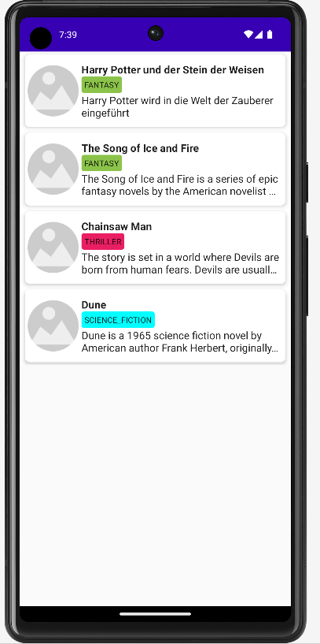

= State 15.12.2022
Neudorfer Niklas
1.0.0, 2022-12-15
ifndef::imagesdir[:imagesdir: .]
//:toc-placement!:
:sourcedir: ../src/main/java
:icons: font
:sectnums:
:toc: left

//Need this blank line after ifdef, don't know why...
ifdef::backend-html5[]

// print the toc here (not at the default position)
//toc::[]

-> #I can get data from my local Endpoint and display it on the Emulator#

* I created a new Project, so I can start from scratch and not have to deal with the old code where I encountered an error which I don't know how to fix at the moment.

