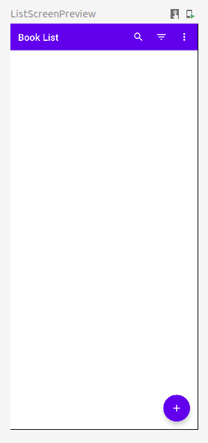

= State 15.12.2022
Neudorfer Niklas
1.0.0, 2022-12-15
ifndef::imagesdir[:imagesdir: .]
//:toc-placement!:
:sourcedir: ../src/main/java
:icons: font
:sectnums:
:toc: left

//Need this blank line after ifdef, don't know why...
ifdef::backend-html5[]

// print the toc here (not at the default position)
//toc::[]

== Current State

-> Udemy Course - finished `22. List Screen - List App Bar Actions`

.Full View of the current Application

.DropDown when pressing the sort button (the middle one)
image::../img/11252022_Sort_By_Genre.png[]

.Menu that pops-up when pressing the vertical-menu Button (the Button on the right side)
image::../img/11252022_Vert_Menu_Button_Pressed.png[]

== Important Notes

lines of code in order to make `by remember { mutableStateOf(false) }` work

[source,kotlin]
====
import androidx.compose.runtime.getValue import androidx.compose.runtime.setValue
====

== Source

* https://www.udemy.com/course/to-do-app-with-jetpack-compose-mvvm-android-development/learn/lecture/27993710#overview[Udemy Course]